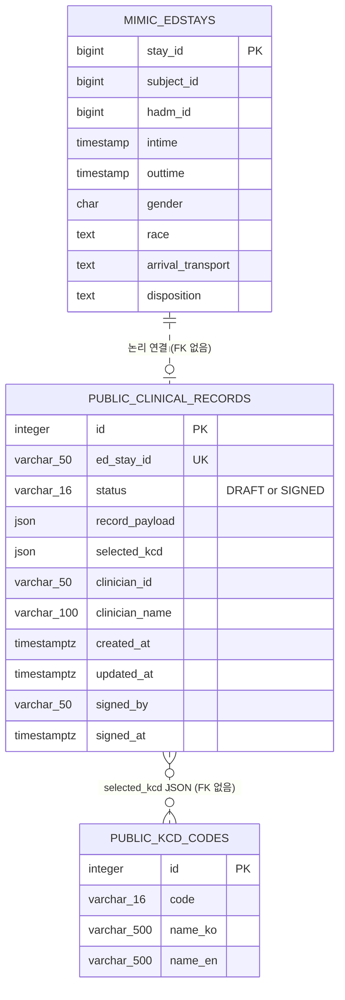

# ER:ON 응급진료기록 ERD (현재 구현 기준)

> 기준: `feature/record-refactor`, 2026-09-03  
> 범위: 응급실 방문, 응급진료기록 임시/인증 저장, KCD 코드 검색

## 관계 및 제약

| 관계 | 카디널리티 | 현재 구현 |
|---|---:|---|
| `mimic.edstays` → `public.clinical_records` | 1 : 0..1 | `ed_stay_id`로 논리 연결. API가 방문 존재 여부를 검사하며 DB FK는 없음 |
| `public.clinical_records` ↔ `public.kcd_codes` | N : M | `selected_kcd` JSON 배열에 코드·진단명·의증 여부를 저장하며 DB FK는 없음 |

## 구현상 주의사항

- `clinical_records.ed_stay_id`는 `varchar(50)`, `edstays.stay_id`는 `bigint`이므로 현재 물리 FK를 설정할 수 없다.
- `ed_stay_id`의 UNIQUE 인덱스로 응급실 방문 한 건당 응급진료기록은 최대 한 건이다.
- `status`는 애플리케이션에서 `DRAFT` 또는 `SIGNED`로 제한한다. DB CHECK 제약은 없다.
- `SIGNED` 기록의 변경 및 재인증 금지는 API 계층에서 처리한다.
- ClinicalNLP의 사전·벡터·정책 테이블은 기록 저장 트랜잭션과 분리된 검색 지원 영역이므로 이 ERD 범위에서 제외한다.

